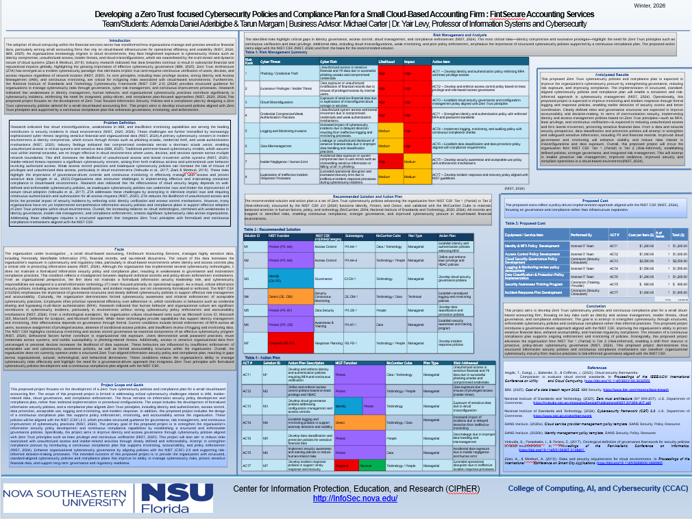

# Zero Trust Cybersecurity Governance Project
## Project Overview

This project developed a Zero Trust-focused cybersecurity governance and compliance plan for a simulated small cloud-based accounting firm, FintSecure Accounting Services. The project focused on strengthening identity and access management, reducing security risks, improving cloud governance, and aligning cybersecurity practices with the NIST Cybersecurity Framework (CSF) 2.0.

## Project Focus

This project focused on applying Zero Trust principles and NIST CSF 2.0 to address cybersecurity risks in a cloud-based accounting environment. Key areas included identity and access management, risk management, cloud security, security monitoring, incident response, compliance, and data protection.

## Security Frameworks & Technologies Referenced

- Zero Trust Architecture (ZTA)
- NIST Cybersecurity Framework (CSF) 2.0
- Microsoft Entra ID
- Microsoft Sentinel
- Microsoft Defender
- Active Directory
- Kali Linux
- Wireshark
- pfSense

## Key Security Areas

- Identity and Access Management (IAM)
- Multi-Factor Authentication (MFA)
- Role-Based Access Control (RBAC)
- Insider Threat Mitigation
- Cloud Security and Governance
- Security Monitoring and Logging
- Incident Response Planning
- Data Protection
- Risk Management
- Compliance and Security Policy Development

## Project Objectives

- Strengthen Identity and Access Management (IAM) through MFA and RBAC
- Reduce risks associated with compromised credentials and insider threats
- Improve cloud security governance and compliance
- Establish security monitoring and logging practices
- Develop incident response and cybersecurity policies
- Strengthen data protection and access controls
- Align cybersecurity controls and practices with NIST CSF 2.0

## My Contributions

- Conducted cybersecurity risk analysis to identify key threats and vulnerabilities
- Developed Zero Trust-focused cybersecurity governance and security policies
- Designed IAM, MFA, and RBAC strategies to strengthen access controls
- Mapped security controls and practices to NIST CSF 2.0
- Developed compliance and security monitoring strategies
- Contributed to incident response and risk management planning
- Evaluated security risks related to phishing, credential compromise, insider threats, cloud misconfiguration, and data leakage

## Risk Assessment

The project identified and analyzed several cybersecurity risks affecting the organization's cloud-based environment, including:

| Risk Area | Security Concern |
|---|---|
| Phishing & Credential Theft | Compromised credentials could provide unauthorized access to organizational systems and data |
| Ransomware & Insider Threats | Malicious or compromised users could disrupt operations or access sensitive information |
| Cloud Misconfiguration | Improperly configured cloud services could expose systems and sensitive data |
| Credential Compromise | Weak or compromised credentials could lead to unauthorized access |
| Legacy Technology | Outdated systems could increase exposure to known vulnerabilities |
| Data Leakage | Sensitive financial or customer information could be exposed or improperly accessed |
| Human Error | Mistakes by employees could result in security incidents or unauthorized data access |

## Zero Trust Security Strategy

The proposed security plan applied Zero Trust principles to reduce unauthorized access and limit the impact of compromised accounts or devices.

Key areas included:

- Identity verification and strong authentication
- Multi-Factor Authentication (MFA)
- Role-Based Access Control (RBAC)
- Least-privilege access
- Continuous security monitoring and logging
- Protection against credential compromise
- Insider threat mitigation
- Secure access to cloud-based resources
- Improved incident response and security governance

- ## NIST CSF 2.0 Alignment

The cybersecurity governance plan was aligned with the NIST Cybersecurity Framework (CSF) 2.0 to provide a structured approach to managing cybersecurity risks.

The project addressed the following areas:

- Identify – Assessed cybersecurity risks, assets, threats, and vulnerabilities
- Protect – Recommended IAM, MFA, RBAC, least-privilege access, and data protection controls
- Detect – Proposed security monitoring, logging, and threat detection practices
- Respond – Developed incident response and cybersecurity response planning
- Recover – Included recovery considerations to support business continuity and reduce the impact of security incidents

## Project Outcome

The project proposed a governance-driven cybersecurity framework designed to strengthen FintSecure Accounting Services' security posture.

The proposed framework focused on:

- Strengthening identity and access management
- Reducing risks from credential compromise and insider threats
- Improving cloud security governance
- Establishing security monitoring and incident response practices
- Aligning cybersecurity policies and controls with NIST CSF 2.0
- Moving the organization's cybersecurity maturity from NIST CSF Tier 1 (Partial) toward Tier 2 (Risk-Informed)

- ## Implementation Roadmap

The proposed cybersecurity plan was organized into several implementation phases:

### Phase 1 – Identity & Access Management
- Implement MFA for critical systems and cloud resources
- Establish RBAC based on job responsibilities
- Apply least-privilege access principles
- Review and manage user access regularly

### Phase 2 – Security Monitoring & Detection
- Establish centralized security logging
- Monitor authentication and access events
- Develop processes for identifying suspicious activity
- Improve visibility into security events

### Phase 3 – Governance & Compliance
- Develop and maintain cybersecurity policies
- Align security controls with NIST CSF 2.0
- Establish regular risk assessments
- Review security controls and compliance requirements

### Phase 4 – Incident Response & Data Protection
- Develop incident response procedures
- Establish processes for reporting and responding to security incidents
- Strengthen data protection and access controls
- Conduct periodic security reviews and improvements

- ## Team & Project Information

- Project: Developing a Zero Trust-focused Cybersecurity Policies and Compliance Plan for a Small Cloud-Based Accounting Firm: FintSecure Accounting Services
- Team Members: Tarun Margam and Ademola Daniel Aderibigbe
- Faculty Advisor: Dr. Yair Levy
- Project Type: Academic Cybersecurity Capstone Project
- Organization: FintSecure Accounting Services (Simulated)

## Project Poster Preview

## Project Files

- `README.md` – Project overview, cybersecurity objectives, risk assessment, Zero Trust strategy, NIST CSF 2.0 alignment, and implementation roadmap.
- `poster.png` – Visual summary of the project, including identified risks, recommended security controls, and proposed outcomes.

- ## Disclaimer

FintSecure Accounting Services is a simulated organization created for academic purposes. The cybersecurity policies, recommendations, risk assessments, and implementation strategies presented in this project are proposed solutions developed as part of an academic cybersecurity project.
